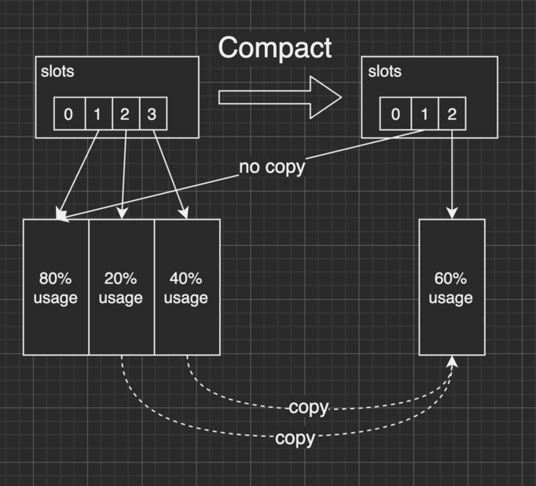

# 实时分布式内存 KV

把在一个点发布的 kv 的 set/remove 操作实时同步到多个点，并保持数据一致性

支持一组多个 set/remove 操作

单点发布，多点订阅，订阅可以级联，级联的路径可以是图状（可循环）

增量传输（如果没有网络故障）

高并发，多核无锁并发读

利用大块 `[]byte` 和少量 `[][]byte` 来完成所有操作，对 Go GC 负担不大

支持大 value，大小不限。大 value 是零拷贝，交给 Go GC 处理

# 使用

https://github.com/nareix/delta/blob/0591750e9fcd40d84149a3634a141b9b2094358d/cmd/delta/sample.go#L130

三级级联订阅示例

# 基本原理

基本的数据结构是 immutable 的 trie 树（带路径压缩）：

当 set/remove 操作后，新建一棵树，这棵树只有一部分节点是指向新的数据，其他的都指向旧的数据和中间节点，因为它们没有变化，然后把新建的树丢给使用者使用。

每隔一段时间有一次 compact 操作，它会新建一棵树，把还没被 remove 掉的有效的数据复制过去（有优化，只复制一部分），与旧的数据在指针上脱离关联，因此在使用者使用完之后，旧的数据就被 Go GC 回收。

# 实现

由于需要发送增量给下游，下游可能遇到网络问题，所以要保存一段时间内的增量。

增量是一个 {op,key,value} 的数组，为了方便后续处理，需要把它变成一棵树，如下图，`set("1235","b"); remove("1234")` 这一组操作变成树之后的样子。

每次操作后的全量也需要保存：因为要给下游发送全量，也因为这个库本身也要给使用者提供高并发操作（range/set）。 

因此每组操作会产生两棵树，一颗是增量树（diff），一颗是全量树（full）。

Commit 结构体记录每组 set/remove 操作。其中 parent 指向上一组操作，diff 是本地操作的增量树，full 是本次操作后的全量树。

version 是本次操作的版本号，从 1 开始递增，作为同步的依据。

本次操作的 full 是由上次的 full 加本次的 diff 得出的。图中的 ref 是引用关系，full 里面的节点引用了 diff 里面的节点，复用了一部分内容。而再下一次的 full 需要 ref 上一次的 ref 的节点的时候，会直接指向最终的节点，不会多次 ref。

Node 结构体记录树的节点。为了节省空间，所有树的节点都是呈 bfs 的逆序排放，child 里的 ptr 记录的是向前的相对位置。ptr 长度由 ptrsize 决定，因为大小固定，所以可以二分查找。

前面的结构体都是在 `[]byte` 里完成的。每次 Commit 过后，给到使用者的是一个 Go 结构体 Snapshot 的指针。

Snapshot 里只有两个字段，slots 是 `[][]byte`，head 是 `int`：

head 是最新的 Commit 在 slots[0] 里的位置。

slots 是使用了哪些大块的 `[]byte`。

slots[0] 固定只存放 Commit 和 Tree，不存 value。Commit 和 Tree 占的空间并不多。

而每次 Commit，slots 经常是不变的，除非是 slots[0] 不够用了，或者是有大 value 进来，它才变。否则就只是在每个 slots 里面追加数据，除了 Snapshot 之外没有新增的 Go Obj。

Compact 的会统计每个 slot 里有效 value 的占比。然后占比大的不复制，只复制占比的。

有效 value 占比计算是在每次 MergeTree 之后能得出来，否则扫描一次全树开销较大。原理是：

- 已知上次全量的总 value 大小

- 已知本次增量的总 value 大小

- 已知本次变更的 value 大小的差值（比如某节点之前 set 的是 "123" 现在是 "2"）

这三个相加可以得出。

TODO：Compact 的优化可以针对实时性场景，比如落后 3s 的 Commit 全部丢掉。

